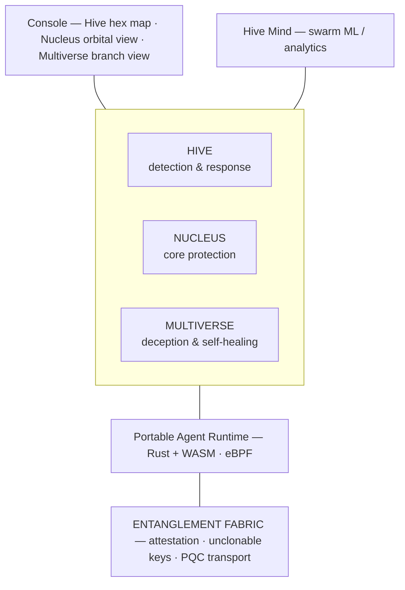

# GENESIS — Nature-Modeled Security for SaaS & Cloud

> *"There is no better design for defense than nature's own processes."*

**GENESIS** is a security platform for SaaS, cloud, and hybrid (cloud + physical/edge)
applications whose architecture, flows, and algorithms are modeled directly on
processes found in nature and physics. Instead of a single central "brain," GENESIS
behaves like a living, self-organizing system: it senses everywhere, protects the
core, binds trust across distance, and heals itself.

> **Naming note:** `GENESIS` is a provisional suite codename. Plane names (Hive,
> Nucleus, Entanglement Fabric, Multiverse) are working titles pending a trademark
> search. See [roadmap.md](roadmap.md) for open naming decisions.

---

## The four planes

| Plane | Modeled on | Responsibility | Doc |
|-------|-----------|----------------|-----|
| **Hive** | Honeybee colony | Distributed detection & response (breadth) | [hive.md](hive.md) |
| **Nucleus** | Atomic model | Data-centric zero-trust protection (depth) | [nucleus.md](nucleus.md) |
| **Entanglement Fabric** | Quantum entanglement | Quantum-safe trust that binds everything across distance | [entanglement-fabric.md](entanglement-fabric.md) |
| **Multiverse** | Parallel universes / many-worlds | Deception, speculative execution & self-healing (resilience) | [multiverse.md](multiverse.md) |

Binding the planes is a connective layer — **Sutra** (Mahabharata-inspired): the
**Ashwamedha Sweep** validates the links/edges of the estate and certifies sovereignty,
and the **Chakravyuha Mesh** is a rotating containment labyrinth (easy to enter, hard to
exit). See [connective-layer.md](connective-layer.md).

---

## Why nature?

Natural systems have been red-teamed by evolution for millions of years. They are:

- **Decentralized** — no single point of failure (a hive survives losing a bee; a
  colony can re-raise a queen).
- **Emergent** — global intelligence arises from simple local rules (swarm quorum,
  stigmergy) which is inherently resistant to targeted manipulation.
- **Unpredictable** — randomized foraging and quantum indeterminacy make the system
  a moving target no attacker can fully model.
- **Self-healing** — immune responses, propolis sealing, and branch rollback contain
  and repair damage automatically.

GENESIS turns these properties into engineering primitives backed by **real,
buildable technology** — not metaphor for its own sake. See
[vision.md](vision.md).

---

## Document map

- [vision.md](vision.md) — philosophy, value proposition, differentiation
- [glossary.md](glossary.md) — full nature ↔ security terminology mapping
- [architecture.md](architecture.md) — master architecture, layered stack, tech, data flow
- [hive.md](hive.md) — swarm plane and the swarm algorithms (ABC, waggle, Lévy, quorum)
- [nucleus.md](nucleus.md) — atomic-model protection plane
- [entanglement-fabric.md](entanglement-fabric.md) — quantum-safe trust foundation
- [multiverse.md](multiverse.md) — parallel-universe deception & resilience
- [connective-layer.md](connective-layer.md) — Sutra: Ashwamedha Sweep & Chakravyuha Mesh (the links in between)
- [integration.md](integration.md) — how the planes mingle, the closed loop, use cases
- [product-device.md](product-device.md) — best-in-market hardware + GENESIS software; on-device vs cloud split
- [threat-model.md](threat-model.md) — adversary model, STRIDE, why this design wins
- [competitive-landscape.md](competitive-landscape.md) — prior art and differentiation
- [roadmap.md](roadmap.md) — phased build plan and the MVP wedge
- [engineering-reference.md](engineering-reference.md) — developer/AI-agent reference for the built code (also see [AGENTS.md](../AGENTS.md))

---

## Status

Pre-implementation. This repository currently contains the **design and vision
documentation**. The build plan and MVP scope are in [roadmap.md](roadmap.md).
