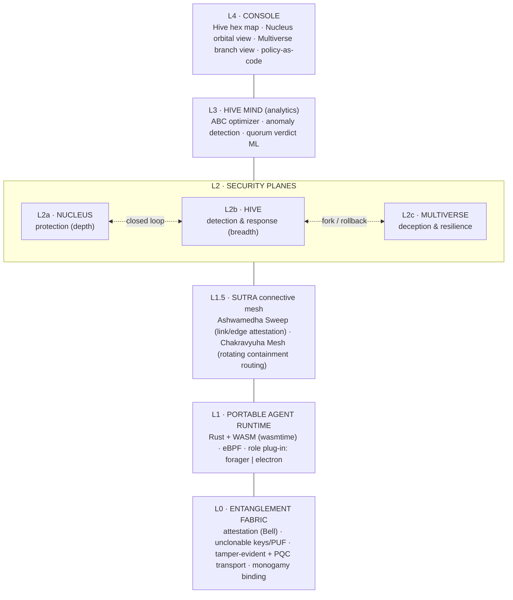
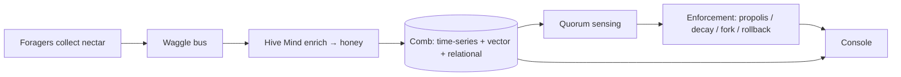
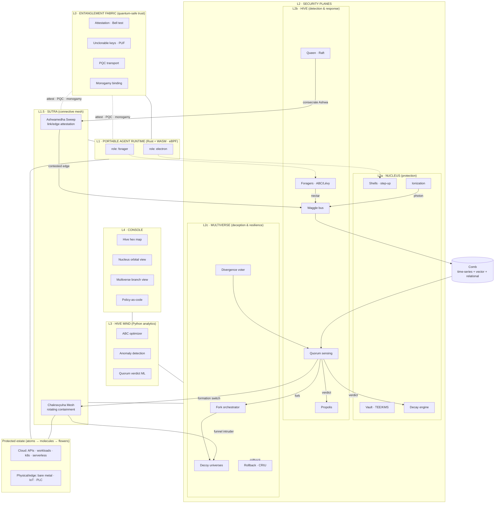

# Master Architecture

GENESIS is a layered platform. A quantum-safe trust **foundation** carries a portable
**agent runtime**, on top of which three security **planes** operate, unified by a
closed detection-to-response loop, analytics, and a console.

## Layered stack



### L0 — Entanglement Fabric (foundation)
Shared Rust crypto/identity library. Provides identity attestation, unclonable
hardware-bound keys, tamper-evident + post-quantum transport, and monogamous device
binding to **every** layer above. Details: [entanglement-fabric.md](entanglement-fabric.md).

### L1 — Portable Agent Runtime
One agent binary (Rust, compiled native + to WASM via `wasmtime`), with optional eBPF
probes on Linux. A **role plug-in** makes the same agent act as a Hive **forager**
(sensing) or a Nucleus **electron** (enforcement). Identity is rooted in L0. This is
what makes "cloud + physical" real: the same artifact runs on serverless, containers,
VMs, bare metal, edge, and IoT.

### L1.5 — Sutra (connective mesh)
The connective tissue between the runtime and the planes, governing the **links** rather
than the nodes. Two Mahabharata-inspired mechanisms: the **Ashwamedha Sweep** — a roaming
attestation token that walks the estate's edges and certifies epoch-wide sovereignty —
and the **Chakravyuha Mesh** — a rotating, egress-hardened containment labyrinth (easy to
enter, hard to exit) that wraps the static Nucleus shells with a dynamic, moving-target
perimeter and funnels intruders into Multiverse decoys. See
[connective-layer.md](connective-layer.md).

### L2 — Security planes
- **L2a Nucleus** — data-centric protection: vault, shells, quantized step-up, decay,
  ionization. See [nucleus.md](nucleus.md).
- **L2b Hive** — swarm detection & response: foragers, waggle bus, quorum, propolis,
  the Queen. See [hive.md](hive.md).
- **L2c Multiverse** — deception & resilience: decoy/shadow universes, divergence
  voting, rollback. See [multiverse.md](multiverse.md).

### L3 — Hive Mind (analytics)
Python service. Runs the Artificial Bee Colony optimizer (agent/resource allocation),
anomaly-detection models, and quorum-verdict scoring. Stateless workers reading from
the comb.

### L4 — Console
Next.js app. Three coordinated visualizations — the Hive **hex map** (live foraging,
waggle recruitment, quarantine), the Nucleus **orbital view** (shells, quantum jumps,
ionization glow), and the Multiverse **branch view** (forks, decoys, rollbacks) — plus
policy-as-code editing and fleet management.

---

## The closed loop (sense → decide → enforce → heal)

```mermaid
sequenceDiagram
    participant N as Nucleus (ionization)
    participant W as Hive · Waggle bus
    participant Q as Hive · Quorum sensing
    participant M as Multiverse
    participant P as Response (propolis/decay/fission)
    N->>W: anomaly / charge-imbalance signal
    W->>Q: recruit agents; corroborate finding
    Q->>Q: N-of-M agreement in time window
    Q-->>M: confirmed threat → fork attacker into decoy universe
    Q-->>P: quarantine (propolis), rotate secrets (decay), isolate node (fission)
    M-->>P: compromised branch → rollback to clean timeline
    P-->>N: drop privilege shell; re-attest identity
```

Detection verdicts are **emergent** (quorum), not issued by a single model. Response is
automatic and layered: isolate, rotate, fork, roll back.

---

## Data flow (nectar → honey → verdict → action)



**Comb storage** is three stores behind one logical hexagonal topology:
time-series (telemetry), vector (behavioral embeddings for anomaly detection), and
relational (assets, policy, the atom/molecule graph). Hex sharding gives blast-radius
isolation per cell.

---

## Complete system diagram

The full platform — all layers, the connective mesh, the three planes, analytics, the
console, shared storage, and the protected estate — with the principal flows.



**Reading the diagram:** the vertical spine (L4→L0) is the platform stack; the horizontal
flows are operational. Foragers collect **nectar** into the **Comb**; **ionization**
signals and forager findings meet at the **waggle bus**; **quorum sensing** issues an
emergent verdict that fans out to response (**propolis** isolate, **decay** rotate,
**fork** into a **decoy universe**, **formation switch** to Chakravyuha). The **Queen**
consecrates the **Ashwamedha Sweep**, whose contested-edge findings re-enter the loop.
The **Entanglement Fabric** admits every action via attestation, PQC, and monogamy.

---

## Technology choices (latest)

| Concern | Choice | Why |
|---------|--------|-----|
| Agents / runtime | **Rust** + **WASM/wasmtime** | Memory-safe, fast, portable to edge/IoT |
| Deep runtime visibility | **eBPF** (Linux) | Kernel-level telemetry without instrumentation |
| Mesh transport | **libp2p gossipsub** and/or **NATS JetStream** | P2P + partition tolerance for the waggle bus |
| Identity | **SPIFFE / SPIRE**, mTLS | Workload identity across cloud + physical |
| Control-plane consensus | **Raft** | Queen leader election / supersedure |
| Crypto | **NIST PQC** (Kyber/Dilithium) + TPM/TEE + PUF | Quantum-safe, unclonable, attested |
| Connective mesh (Sutra) | Rotating mTLS/SPIFFE + dynamic routing/segmentation, eBPF egress control | Chakravyuha rotation + Ashwamedha edge attestation |
| Micro-VMs | **Firecracker** (+ gVisor, CRIU) | Cheap per-session universes, snapshot/rollback |
| Analytics | **Python** (ABC, anomaly ML) | Fast iteration, ML ecosystem |
| Console | **Next.js** + WebGL/Canvas viz | Real-time hex/orbital/branch visualization |
| Storage | Time-series + **vector DB** + relational | Telemetry, embeddings, graph/policy |

---

## Repository layout

```
/fabric      Entanglement Fabric — Rust crypto/identity library (L0)
/runtime     Portable agent runtime — Rust + WASM, eBPF, role plug-ins (L1)
/nucleus     Atomic-model protection plane (L2a)
/hive        Bee-swarm detection & response plane (L2b)
/multiverse  Parallel-universe deception & resilience plane (L2c)
/sutra       Connective mesh — Ashwamedha Sweep + Chakravyuha Mesh (L1.5)
/adapters    Flower adapters (HTTP/API, cloud, host, network, DB)
/hive-mind   Python analytics — ABC optimizer, anomaly, quorum ML (L3)
/console     Next.js dashboard (L4)
/deploy      docker-compose + Kubernetes manifests
/docs        This documentation set
```

---

## Cross-cutting properties

- **No single point of failure** — Queen re-election (L2b) + emergent quorum verdicts.
- **Moving target** — Lévy-flight scanning (Hive), MTD ambiguity (Nucleus/Fabric),
  universe forking (Multiverse).
- **Quantum-safe** — PQC everywhere via L0.
- **Portable** — one agent (L1) for cloud and physical.
- **Multi-tenant** — a shared control plane with per-tenant comb isolation and
  per-tenant prime universes (see [roadmap.md](roadmap.md) open decisions).

See [integration.md](integration.md) for how the planes reinforce each other and
[threat-model.md](threat-model.md) for the adversary model.
