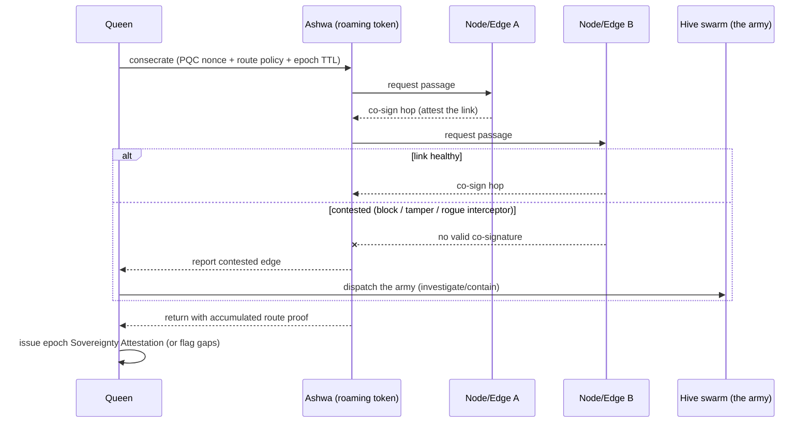
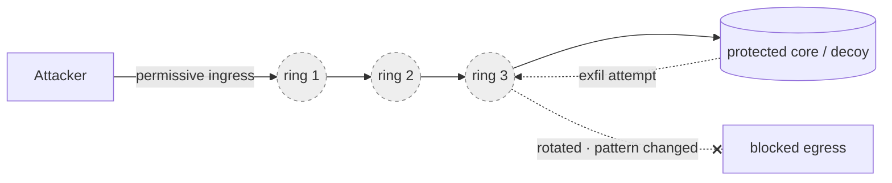
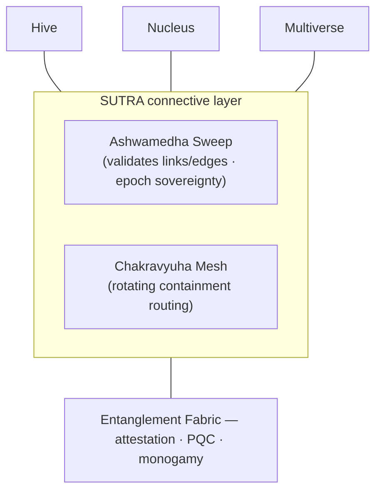

# Connective Layer — "Sutra" (Ashwamedha Sweep & Chakravyuha Mesh)

*Sutra (सूत्र) = "thread / link".* Where the four planes protect **nodes** (assets) and
**realities**, the connective layer governs the **links between them** — the paths
traffic travels and the routing/containment around the core. It draws two mechanisms
from the Mahabharata:

- **Ashwamedha Sweep** — a roaming sovereignty attestation that validates the **edges**
  of the estate and periodically certifies that the whole domain is under trusted
  control.
- **Chakravyuha Mesh** — a rotating, layered **containment labyrinth**: easy to enter,
  hard to exit, with continuously reconfiguring rings around the core.

Both are built on the **Entanglement Fabric** (attestation, PQC, monogamy) and
orchestrated by the **Queen** (Hive control plane). They are the "in-between processes
and links" that tie the planes together.

---

## 1. Ashwamedha Sweep — roaming sovereignty attestation

### The rite → the mechanism
In the Ashwamedha Yagna, a consecrated horse is released to roam freely; wherever it
wanders unchallenged, the king's sovereignty is affirmed. Any ruler who stops or seizes
the horse declares hostility and must face the army that follows it. If the horse
returns unchallenged, sovereignty over all it traversed is proven.

GENESIS releases a **consecrated roaming attestation token** — the *Ashwa* — that walks
the **edges** of the asset graph. Foragers (Hive) validate *nodes*; the Ashwa validates
the *links between them* and certifies estate-wide sovereignty each epoch.

| Rite element | Security meaning | Real primitive |
|--------------|------------------|----------------|
| Consecrated horse | Roaming attestation token released by the Queen | PQC-signed, monogamous nonce token (Fabric) |
| Free, unpredictable roaming | Unpredictable path across links (MTD) | Lévy-random graph walk |
| Each land it enters | Each hop/edge must let it pass by co-signing | Hop-by-hop co-signature + route accumulator |
| A king challenges the horse | A node blocks/tampers/intercepts the token | Contested-edge event → investigate |
| The following army | Response converges on the contested edge | Hive swarm recruitment (waggle) |
| Horse returns unchallenged | Full sweep completes within the time bound | Epoch **Sovereignty Attestation** issued |

### How it works

The Ashwa accumulates a **chain of hop co-signatures** — a transitive proof that every
traversed link is trusted and unmodified. A completed, unchallenged sweep yields a signed
**Sovereignty Attestation** for the epoch: cryptographic evidence that the estate's
*links* (not just nodes) are under trusted control.

### What it catches
- Rogue / unauthorized nodes inserted on a path (MITM on links).
- Shadow routes and topology drift between assets.
- Silent link tampering that node-only monitoring misses.
- Segmentation failures (a link that should not exist but passes traffic).

Multiple Ashwas can run in parallel for large estates; routes are randomized (Lévy) so
an attacker cannot predict when or where the sweep arrives.

---

## 2. Chakravyuha Mesh — rotating containment labyrinth

### The formation → the mechanism
The Chakravyuha is a multi-ring rotating battle maze: **easy to enter, extremely hard to
exit**. Abhimanyu knew how to break *in* but not *out*, and was trapped. GENESIS turns
this into the **routing and containment fabric** between the outside world and the core:
permissive ingress that funnels intruders inward, and a **guarded, moving-target egress**
they cannot navigate back out.

| Formation element | Security meaning | Real primitive |
|-------------------|------------------|----------------|
| Concentric rings (7, configurable) | Layered enforcement between edge and core | Ordered mesh policy rings (gateway→identity→policy→behavioral→deception→egress→core) |
| Rotating rings | Keys/order/routing reconfigure continuously (MTD) | Short-lived cert rotation + dynamic routing/segmentation |
| Easy to enter | Permissive, inviting ingress (funnel) | Tarpit / decoy funnel |
| Hard to exit | Egress is the hardened moving target | Egress lockdown / DLP / data-diode-like control |
| Trapped intruder (Abhimanyu) | Intruder penetrates but cannot exfiltrate | Containment + Multiverse decoy handoff |
| Alternate vyuhas (Padma, Suchi…) | Adaptive defensive formations by threat level | Switchable routing/enforcement profiles |

### The signature property: easy in, hard out

Ingress is deliberately permissive — it *pulls* an attacker inward (pairing with the
Multiverse: what they "break into" is a decoy universe). **Egress is the defended
direction**: to exfiltrate, data must pass outward through rings whose keys, ordering,
and routing have **rotated** since entry, so the path the attacker learned on the way in
no longer exists. Data can flow in; it cannot flow out.

### Rotation (Moving Target Defense at the routing layer)
Each ring's identity (mTLS certs), traversal challenge, and routing topology reconfigure
on a schedule or trigger. An attacker who maps one ring finds the next already changed —
network-level MTD applied to the connective mesh, wrapping the **static** Nucleus shells
with a **dynamic** rotating perimeter.

### Adaptive formations
Like the epic's many vyuhas, the mesh switches **formation profiles** by posture:
- **Open formation** — normal operations, low friction.
- **Chakravyuha** — under attack: maximum containment, tightest egress, fastest rotation.
- **Suchi (needle)** — targeted lockdown of a single compromised segment.

Formation changes are policy-driven and can be triggered automatically by a Hive
quorum verdict.

---

## How Sutra binds the planes ("in between")

- **Entanglement Fabric** provides the crypto substrate (roaming token attestation, PQC
  transport, monogamy so the Ashwa cannot be cloned).
- **Hive** — the Queen consecrates and releases the Ashwa; contested edges recruit the
  swarm ("the following army"); a quorum verdict can switch the mesh formation.
- **Nucleus** — the Chakravyuha rings are the **rotating** outer perimeter wrapping the
  **static** atomic shells; the core they guard is the Nucleus vault.
- **Multiverse** — the "easy-in / hard-out" funnel delivers intruders into **decoy
  universes**; egress lockdown ensures nothing usable leaves.

---

## Build phase (Phase 2c — Sutra)
1. **Ashwamedha Sweep**: roaming attestation token + hop co-signature protocol + route
   accumulator; epoch Sovereignty Attestation; contested-edge → waggle recruitment.
2. **Chakravyuha Mesh**: ordered enforcement rings with rotating identity (short-lived
   certs) + dynamic routing; egress-hardened containment.
3. **Formations**: switchable profiles (Open / Chakravyuha / Suchi), auto-triggered by
   quorum.

## Verification targets
- A rogue node inserted on a link fails to co-sign → contested edge raised; sweep flags
  the gap (no Sovereignty Attestation issued).
- The Ashwa token cannot be cloned/replayed onto another path (monogamy).
- After ring rotation, an egress path learned on ingress no longer works.
- A quorum verdict switches the mesh into Chakravyuha formation and funnels the session
  into a decoy universe with egress blocked.

See [architecture.md](architecture.md), [integration.md](integration.md), and
[glossary.md](glossary.md).
