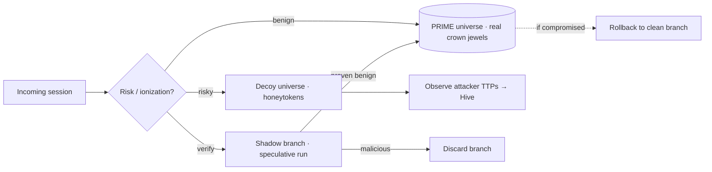

# Multiverse — Deception & Resilience Plane

Modeled on parallel universes / the many-worlds interpretation. Many-worlds says every
measurement **forks reality** into branches. GENESIS forks the *system* on demand: risky
sessions are diverted into isolated **decoy universes**, risky requests are
**shadow-executed** in throwaway branches, and compromised branches are **rolled back**
to a clean timeline. The attacker can never be sure which universe is real — and can
never affect the one that is. Built with **real tech** (micro-VMs, snapshots, traffic
mirroring), not science fiction.

## Core idea

There is exactly one **prime universe** — the real production environment holding real
crown jewels. Everything else is an **ephemeral branch** that can be created, observed,
and destroyed at will.

## Physics → security → primitive

| Many-worlds concept | Security meaning | Real primitive |
|---------------------|------------------|----------------|
| **Branching reality** | Fork the system into parallel realities on demand | Micro-VM fork (**Firecracker**), gVisor |
| **Parallel decoy universe** | Attacker isolated in a mirror of prod | Per-session VM + honeytokens |
| **Speculative / shadow branch** | Run a risky request in a throwaway branch first | Traffic mirroring (service-mesh shadow), eBPF |
| **N-universe divergence** | Diverse replicas diverge → compromise | N-version execution + voting, record-replay |
| **Per-observer branch** | Each session its own universe → containment | Ephemeral micro-VM per identity |
| **Branch rollback / alt. timeline** | Discard compromised branch, restore clean | **CRIU** snapshot + rollback |
| **Schrödinger (breached & not)** | Attacker can't tell decoy from prime | Indistinguishable mirror environments |
| **Prime universe** | Golden production state | Canonical timeline |

---

## Mechanisms

### Decoy universes (deception at scale)

When Hive quorum or Nucleus ionization flags a session as hostile, the Multiverse
**forks** that session into a decoy universe — a high-interaction mirror of production
seeded with **honeytokens** (synthetic credentials/data). The attacker proceeds,
believing they are in prod, while:

- the prime universe is never touched;
- every action is recorded to study **TTPs** (fed back to the Hive);
- the honeytokens are tripwires — any use elsewhere is a guaranteed-malicious signal.

Because Entanglement Fabric tokens are **bound to their universe**, credentials looted
from a decoy are useless outside it, and attestation prevents **branch-hopping** back
to prime.

### Shadow (speculative) execution

A borderline-risky request is **mirrored** into a shadow branch and executed there
first. Only if it proves benign does it commit to the prime universe; if it exhibits
malicious behavior (exfiltration, tampering), the branch is discarded and the request
never reaches production data.

### N-universe divergence detection

Run a workload in **N** parallel universes with deliberately diverse configurations
(different runtimes, memory layouts, library versions). Benign inputs produce identical
behavior; an exploit that depends on a specific environment causes **divergence**. The
divergence voter reports disagreement to Hive **quorum sensing** — turning
N-version execution into a detection sensor. This neutralizes many zero-days: an exploit
that works in one universe fails in the others and is exposed by the disagreement.

### Branch rollback (self-healing)

Universes are checkpointed (CRIU snapshots). If a branch is confirmed compromised, it is
**rolled back** to the last clean checkpoint — the immune-system counterpart to Hive
propolis and Nucleus fission. Damage is discarded, not repaired in place.

### Per-session containment

Each risky identity can be given its **own** ephemeral universe (micro-VM), so one
compromised session cannot affect any other — blast-radius reduced to a single branch.

---

## Interaction with the other planes

- **Hive** — the Queen orchestrates forking; decoy universes are the swarm's deception
  field ("decoy drones"); divergence votes feed quorum sensing; rollback is hygienic
  self-healing. Foragers patrol decoy universes to harvest attacker intelligence.
- **Nucleus** — crown jewels stay only in the prime universe; decoys carry honeytokens;
  an ionization spike is a trigger to fork.
- **Entanglement Fabric** — per-universe identity binding + attestation prevent an
  attacker from escaping a decoy with usable credentials or hopping branches.

See [integration.md](integration.md).

---

## Console (branch view)

A live tree of universes: the prime timeline plus active decoy/shadow branches,
color-coded by risk, showing forks as they happen, attacker movement inside decoys, and
rollbacks collapsing compromised branches.

## Build phase (Phase 2b)

1. Firecracker **fork orchestrator** (spawn/destroy ephemeral universes).
2. **Decoy** universe with honeytoken seeding + TTP recorder.
3. **Shadow** execution via traffic mirroring.
4. **N-version divergence voter** wired into Hive quorum.
5. **Snapshot/rollback** self-heal (CRIU).

## Verification targets

- A flagged session is forked into a decoy without touching prime (assert prime state
  unchanged).
- Honeytokens used outside their decoy raise a guaranteed-malicious alert.
- An environment-specific exploit triggers divergence and is voted a threat.
- A compromised branch rolls back to a clean checkpoint and is destroyed.
