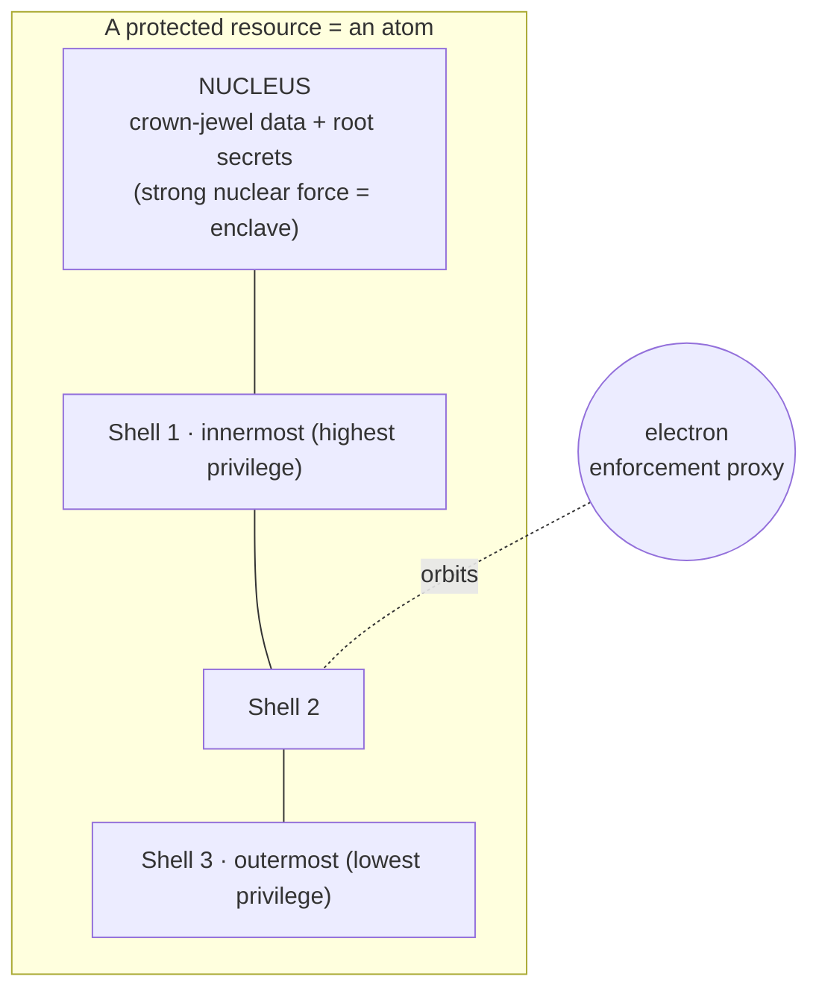

# Nucleus — Atomic-Model Protection Plane

Modeled on the atom. Crown-jewel data lives in a tightly bound **nucleus**; **electron**
enforcement agents orbit it in **shells** (privilege tiers); privilege changes are
**quantized** (they cost energy = step-up auth); secrets **decay** (auto-rotation); and
compromise shows up as **ionization** (charge imbalance). Where Hive gives breadth,
Nucleus gives **depth** — protecting what matters most.

## The atom as a defense-in-depth model

Each **shell** is a policy-enforcement ring (a PEP). To move inward (gain privilege),
a principal must be promoted between discrete shells — never continuously.

## Components

| Component | Role | Primitive |
|-----------|------|-----------|
| **Nucleus vault** | Crown-jewel data + root of trust | TEE/HSM/KMS, confidential computing |
| **Shell engine** | Discrete access tiers + transition rules | ABAC/ReBAC PEPs |
| **Electron agent** | Identity-aware proxy orbiting a resource | Runtime "electron" role (mTLS/SPIFFE) |
| **Spin service** | Dual-control / 2-factor state | Paired verification |
| **Decay engine** | Half-life rotation/expiry | Scheduler |
| **Ionization analyzer** | Charge-imbalance anomaly scoring | Feeds Hive quorum |
| **Bonding registry** | Trust federation graph ("molecules") | Service-mesh trust graph |

---

## Mechanisms (physics-modeled)

### Shell model + quantized transitions (step-up auth)

Privilege tiers are **discrete orbitals**. A principal changes shell only by absorbing
a quantum of "energy" — a step-up authentication event whose strength must match or
exceed the gap between shells:

$$ \Delta E = E_{\text{inner}} - E_{\text{outer}} \le E_{\text{auth}} $$

A **selection rule** policy governs which transitions are even permitted (e.g. no
direct jump from outermost to nucleus). This makes privilege escalation explicit,
auditable, and rate-limited by design.

### Pauli exclusion — session uniqueness

No two identities/sessions may occupy the same quantum state. Cryptographically, GENESIS
guarantees a given credential/session state cannot coexist in two places — killing
replay and token duplication. Complemented by **monogamy** device binding from the
Entanglement Fabric.

### Spin — dual control

Sensitive operations require a **spin pair** (up + down): two independent
authorizations / factors that must align. Modeled on paired electron spin; implemented
as dual-control approval or entangled 2-factor.

### Ionization — anomaly as charge imbalance

An entity's net **charge** is the balance between its authorized "protons" (identity
claims) and its orbiting "electrons" (privileges/agents actually present). Imbalance —
missing enforcement, extra privileges, unexpected behavior — makes the atom an **ion**:

$$ \text{charge}(x) = (\text{claimed privilege}) - (\text{verified privilege}) $$

A non-zero charge produces an **ionization score** that is emitted as a photon (event)
onto the Hive waggle bus, where quorum sensing decides if it is a real threat.

### Radioactive decay — automatic rotation

Every secret/token/credential has a **half-life** $t_{1/2}$. Its trust "activity"
decays exponentially, forcing rotation before it becomes stale:

$$ A(t) = A_0 \cdot 2^{-t / t_{1/2}} $$

Risky configurations are modeled as **unstable isotopes** that decay toward a hardened
baseline (auto-remediation). Rotation is proactive, not reactive.

### Bonding — trust federation

Atoms **bond** into **molecules** (trusted service meshes). Bond types:
- **Covalent** — mutual authentication (shared trust between peers).
- **Ionic** — delegated authorization (one grants, one receives).

The bonding registry is the trust graph the Hive treats as its field of "flowers".

### Uncertainty & tunneling

- **Heisenberg uncertainty** → Moving Target Defense: enforcement placement is
  randomized so an attacker cannot know the defense state without perturbing (and
  revealing) themselves.
- **Quantum tunneling** → a boundary crossed that "should" be impossible (an entity
  appearing past a barrier without a valid transition) is flagged as an anomaly.

### Fission & fusion

- **Fission** — isolate/contain a compromised node, splitting it off and emitting alert
  "energy". The enforcement counterpart of Hive propolis.
- **Fusion** — correlate multiple weak signals into a single high-confidence verdict.

---

## Interaction with the other planes

- **Entanglement Fabric** supplies the real primitives for spin/entangled tokens
  (unclonable, monogamous, attested) and PQC-protected shell transitions.
- **Hive** consumes ionization scores as waggle-bus signals; a quorum-confirmed threat
  drives Nucleus responses (shell drop, decay rotation, fission).
- **Multiverse** keeps crown jewels only in the **prime** universe; decoy universes get
  synthetic honeytoken data so an attacker never touches a real nucleus.

See [integration.md](integration.md).

---

## Observatory (console view)

The Nucleus view is a live **Bohr-model** of protected resources: shells, orbiting
electron proxies, quantum jumps (privilege changes) rendered as photon emissions, and
an **ionization glow** on entities whose charge is imbalanced.

## Verification targets

- Step-up: forbidden shell transitions (selection-rule violations) are rejected.
- Uniqueness: a duplicated session state is detected and refused (Pauli/monogamy).
- Decay: a secret past $t_{1/2}$ threshold is auto-rotated.
- Ionization: an injected privilege imbalance produces a proportional score on the bus.
