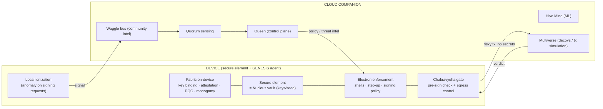

# Product & Device Strategy — Best-in-Market Hardware + GENESIS Software

**Decision:** GENESIS does **not** build silicon from scratch. We anchor on the best
proven secure hardware in the market and make the **software the moat** — the layered,
nature-modeled defenses (Hive, Nucleus, Entanglement Fabric, Multiverse, Sutra) that turn
a passive key vault into an active, self-defending one.

Keys live in a hardened **secure element**; everything that makes GENESIS special lives in
the software wrapped around it.

---

## Two tracks

| Track | Device anchor | Why | Priority |
|-------|---------------|-----|----------|
| **A — Software-led MVP (widest reach)** | **Mobile secure enclave**: Apple **Secure Enclave**, Android **StrongBox/Titan M** | The best secure element is already in every user's pocket — no hardware to ship, fastest to market | **First** |
| **B — Flagship cold device (deepest)** | Partner-integrate a **best-in-class hardware wallet**: **Ledger** (ST33 SE + embedded app SDK) and/or **Trezor Safe** (open firmware, Optiga SE); crypto-native **Solana Seeker** (Seed Vault) | For users who want a dedicated air-gapped/cold device; leverages an existing ecosystem instead of building one | Second |
| **C — Enterprise custody** | **HSMs** (Thales, YubiHSM), **AWS Nitro Enclaves**, **Intel SGX** | Institutional custody backends | Later |

**Hardware-agnostic by design:** a **Secure Element HAL** (hardware abstraction layer) lets
the same GENESIS software bind to Secure Enclave, StrongBox, SE050/OPTIGA/ST33, or an HSM.
We are portable across devices; the hardware is a swappable substrate.

---

## Candidate hardware (best-in-market)

| Option | Strength | Trade-off |
|--------|----------|-----------|
| **Apple Secure Enclave** | Huge install base, strong attestation, biometrics | Closed; iOS-only APIs |
| **Android StrongBox / Titan M2** | Tamper-resistant, wide reach | Fragmented across OEMs |
| **Ledger (ST33, BOLOS app SDK)** | Largest hardware-wallet ecosystem, embedded apps, CC EAL5+ SE | Closed SE; app model constraints |
| **Trezor Safe (Optiga Trust)** | Open-source firmware, auditable | Smaller ecosystem |
| **Solana Seeker (Seed Vault)** | Crypto-native phone, Seed Vault APIs, SE | Solana-centric, niche install base |
| **Dedicated SE chips (NXP SE050, Infineon OPTIGA, ST33)** | Full control for a flagship device later | Requires hardware productization |
| **HSM / Nitro Enclave / SGX** | Institutional-grade, attestable | Not consumer; backend only |

**Recommended anchor:** start on **mobile secure enclave (Apple + Android)** for the MVP,
then partner-integrate **Ledger** (and evaluate **Solana Seeker**) for the flagship cold
track. Keep everything behind the SE HAL.

---

## On-device vs. cloud split

Sensitive key operations never leave the secure element; heavy compute (simulation, ML,
decoys, community intel) runs in the cloud companion. Only privacy-preserving signals
cross the boundary.

| Runs on-device | Runs in cloud companion |
|----------------|-------------------------|
| Key vault (SE) = Nucleus core | Hive Mind analytics / anomaly ML |
| Electron enforcement (shells, step-up, signing) | Waggle bus + community threat intel |
| Fabric key binding, attestation, PQC, monogamy | Queen control plane + quorum aggregation |
| Local ionization (fast anomaly) | Multiverse decoys + heavy tx simulation |
| Chakravyuha pre-sign gate (local portion) | Fleet-wide quorum verdicts |

---

## What we need for this approach (delta)

- **Secure Element HAL** abstracting Secure Enclave / StrongBox / SE chips / HSM.
- **Platform keystore + attestation APIs**: iOS Secure Enclave/DeviceCheck, Android
  Keystore/Key Attestation, plus vendor SDKs for Track B.
- **Partnership / SDK access**: Apple + Google (built-in), **Ledger developer program**,
  **Trezor**, **Solana Mobile Stack (Seed Vault)** as needed.
- **PQC + MPC/threshold libraries** that run alongside a constrained SE.
- **Tx simulation** engine (cloud) for the Chakravyuha pre-sign gate.
- Everything else (Rust runtime, waggle bus, Hive Mind, decoys) as in
  [architecture.md](architecture.md).

---

## Plane mapping on device + cloud

| Plane | On the best-in-market device | In the companion cloud |
|-------|------------------------------|------------------------|
| **Nucleus** | Keys in SE; shells, step-up, signing policy | Policy authoring, ionization aggregation |
| **Entanglement Fabric** | SE key binding, monogamy, attestation, PQC handshakes | Attestation verification, PQC key mgmt |
| **Hive** | Local forager telemetry | Waggle bus, quorum, Queen, threat intel |
| **Multiverse** | Enforces the pre-sign verdict | Decoy universes + tx simulation |
| **Sutra** | Chakravyuha local egress gate | Ashwamedha attestation of the device federation; rotating mesh |

---

## Positioning

> A **self-defending wallet** built on the world's best secure hardware — where the key
> can't be copied, the theft can't be spent, the breach lands in a decoy, and every device
> in the fleet learns from every attack.

The hardware earns trust (proven, certified secure elements); the **software earns the
moat** (active swarm defense, deception, egress labyrinth, community immunity,
quantum-safe trust).

See [roadmap.md](roadmap.md) for sequencing and [use-cases in integration.md](integration.md).
