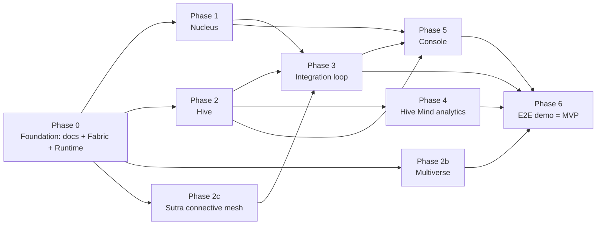

# Roadmap

Phased, buildable plan. The Entanglement Fabric and portable agent runtime are the
**foundation**; the three planes build in parallel on top; a closed loop, analytics,
console, and an end-to-end demo complete the MVP.

## Dependency overview

---

## Phase 0 — Foundation
- Author the full design doc set (this `/docs` folder). **Done.**
- **Entanglement Fabric** (`/fabric`, Rust): attestation (Bell test), hardware-bound
  keys / PUF enrollment, PQC transport (hybrid Kyber/Dilithium), monogamy binding,
  tamper-evident entangled tokens.
- **Portable agent runtime** (`/runtime`, Rust + WASM): role plug-in (forager |
  electron), eBPF probe hooks, identity rooted in the Fabric.
- **Shared mesh**: libp2p gossipsub / NATS over Fabric transport; SPIFFE identity.
- Monorepo tooling: cargo workspace, pnpm (console), uv/poetry (hive-mind); shared
  message schemas (protobuf/JSON) for nectar/honey/waggle/ionization.

## Phase 1 — Nucleus *(parallel with 2, 2b)*
- Vault (TEE/KMS) + root of trust.
- Shell access engine (ABAC/ReBAC) + quantized step-up with selection rules.
- Decay engine (half-life rotation) + Pauli-exclusion session uniqueness.
- Entangled dual-control (spin) using the Fabric.
- Ionization analyzer emitting scores to the waggle bus.

## Phase 2 — Hive *(parallel with 1, 2b)*
- Forager with ABC role state machine (employed / onlooker / scout + abandonment).
- Two flower adapters: HTTP/API and Host; Lévy-flight MTD scheduler.
- Waggle-bus recruitment + pheromone deposit/decay.
- Queen (Raft) leader election + supersedure; guard-bee zero-trust gateway.
- Quorum-sensing verdict service; propolis quarantine action.
- WASM build target (proves edge/physical portability).

## Phase 2b — Multiverse *(parallel with 1, 2)*
- Firecracker fork orchestrator (spawn/destroy ephemeral universes).
- Decoy universe with honeytoken seeding + TTP recorder.
- Shadow (speculative) execution via traffic mirroring.
- N-version divergence voter wired to Hive quorum.
- CRIU snapshot / rollback self-heal.

## Phase 2c — Sutra connective mesh *(parallel with 1, 2, 2b)*
- **Ashwamedha Sweep**: roaming attestation token + hop co-signature protocol + route
  accumulator; epoch Sovereignty Attestation; contested-edge → waggle recruitment.
- **Chakravyuha Mesh**: ordered enforcement rings with rotating identity + dynamic
  routing; egress-hardened containment funneling into Multiverse decoys.
- Switchable **formations** (Open / Chakravyuha / Suchi), auto-triggered by quorum.

## Phase 3 — Integration loop *(depends on 1 + 2)*
- Wire the closed loop: ionization → waggle → quorum → fission / decay / **fork** /
  rollback.
- Scout-discovered assets auto-register as protected atoms.
- Unified asset graph (atoms → molecules → flowers).

## Phase 4 — Hive Mind analytics *(depends on 2)*
- Python: ABC optimizer (allocation), anomaly-detection models, quorum-verdict scoring.

## Phase 5 — Console *(depends on 1, 2, 3)*
- Hive **hex map**, Nucleus **orbital view**, Multiverse **branch view**.
- Policy-as-code editor; fleet management.

## Phase 6 — E2E demo = **MVP wedge**
**Scenario: self-custody wallet defense on a best-in-market secure element** (Apple Secure
Enclave / Android StrongBox; Ledger for the flagship cold track — see
[product-device.md](product-device.md)). Software is the moat; hardware is the proven
substrate.
- Device: SE-bound, quantum-safe keys (Fabric) + electron enforcement (Nucleus shells /
  step-up) + local Chakravyuha pre-sign gate.
- Cloud companion: Queen + quorum + waggle community intel + Multiverse tx-simulation /
  decoy.
- Demo flow: a drainer transaction is **simulated pre-sign** → flagged → attacker session
  **funneled into a decoy wallet** (real keys/funds untouched) → community fleet alerted
  → stolen key material proven **unusable off-device** → shown live on the console.

---

## MVP definition

The MVP is a **thin vertical slice through all four layers**, not one plane in
isolation — because the unique, defensible story is the *closed loop* (Hive detects →
Nucleus/Multiverse enforce), SPOF-free and emergent. Scope:

- Fabric: attestation + PQC transport + monogamous tokens (EF-A/B/C).
- Runtime: forager + electron roles; native + WASM.
- Hive: ABC foragers, 2 adapters, Lévy MTD, waggle bus, Raft Queen, quorum, propolis.
- Nucleus: vault, shells + step-up, decay, ionization.
- Multiverse: fork orchestrator + decoy + rollback (shadow & N-version deferred).
- Console: the three live views for the demo scenario.

## Verification (per [architecture.md](architecture.md) targets)
- Docs render and stay internally consistent.
- Unit/property tests: ABC selection, Lévy tail, pheromone decay, quorum threshold,
  monogamy binding, PQC handshake, step-up selection rules, decoy isolation, rollback.
- `docker-compose up` runs the full detect → decide → enforce → heal demo.
- WASM agent boots on a constrained target (physical + cloud proof).

---

## Open decisions (before/at build handoff)

1. **Suite name** — provisional `GENESIS`; confirm after a trademark search. Plane names
   (Hive, Nucleus, Entanglement Fabric, Multiverse) likewise provisional.
2. **Tenancy** — recommended: multi-tenant control plane with per-tenant comb isolation
   and per-tenant prime universes.
3. **MVP depth** — recommended: thin full-stack slice (above) over a thick single-plane
   build, to prove the closed-loop differentiator.
4. **Compliance** — note SOC2/ISO in the threat model now; implement controls later;
   flag FedRAMP if targeting public sector early.
5. **Cost gating** — policy for when to fork universes / run N-version execution, to
   bound resource cost.
6. **Mesh transport** — libp2p gossipsub vs NATS JetStream: decide in Phase 0 spike.
